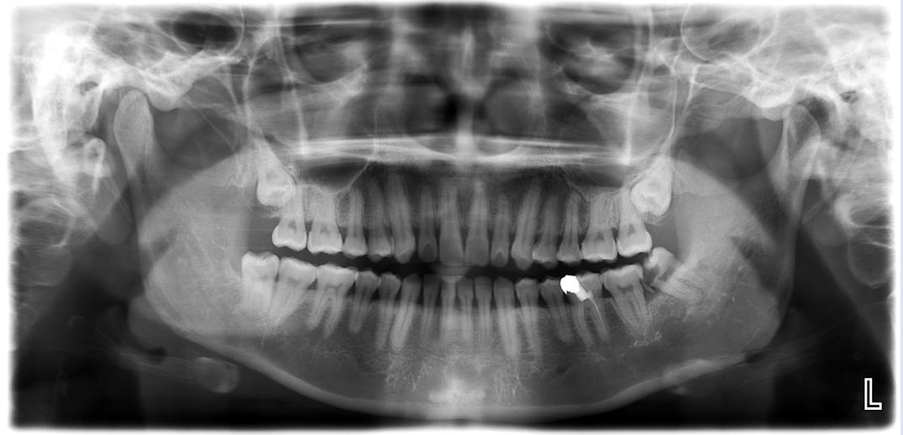

# 🦷 Dental AI System

AI-powered dental radiograph analysis platform for **FDI tooth segmentation, caries segmentation, and impacted-tooth segmentation**, with automated reporting and dentist-oriented visualization.

## Overview

**Dental AI System** is a fully containerized AI application designed to assist dentists in analyzing panoramic dental radiographs.

The system combines **deep learning, computer vision, and full-stack development** to provide automated pixel-level segmentation of dental structures and abnormalities, while allowing dentists to review, annotate, and validate AI results.

### What it does

- 🦷 **FDI Tooth Segmentation** — Segments and identifies teeth using the FDI numbering system
- 🩻 **Caries Segmentation** — Detects and segments carious lesions at pixel level
- 🔎 **Impacted Tooth Segmentation** — Segments impacted teeth, including impacted wisdom teeth
- ✏️ **Manual Annotation** — Allows dentists to draw and save annotations on radiographs
- 📄 **PDF Reports** — Automatically generates diagnostic reports with AI findings and annotations
- ⚡ **GPU-Accelerated Inference** — Supports NVIDIA CUDA for deep learning inference
- 🐳 **Containerized Deployment** — Frontend, backend, and database orchestrated with Docker Compose

---

## 🏗️ System Architecture

The application is organized into three containerized services:

```text
                    ┌─────────────────────┐
                    │    Dentist / User   │
                    └──────────┬──────────┘
                               │
                               ▼
                    ┌─────────────────────┐
                    │      Frontend       │
                    │   React + Nginx     │
                    └──────────┬──────────┘
                               │ REST API
                               ▼
                    ┌─────────────────────┐
                    │       Backend       │
                    │ FastAPI + AI Models │
                    └───────┬───────┬─────┘
                            │       │
                  ┌─────────┘       └──────────┐
                  ▼                            ▼
          ┌───────────────┐             ┌──────────────┐
          │    Database   │             │  AI Inference │
          │     MySQL     │             │ PyTorch/CUDA  │
          └───────────────┘             └──────────────┘
## 🖥️ Application Preview



